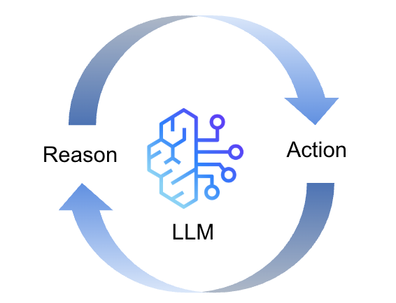
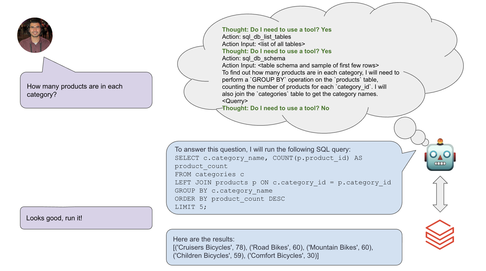

# Query Writer Agent
This repository contains an implementation of a ReAct agent to create and run queries on databases from natural language. 

## Main Features
- Generate sql queries from a natural language prompt
- Run the generated query on the db with user's prompt
- By design, the agent is instructed not to automatically run the query, as a safeguard measure. However, this can easily be changed by updating the prompt instructions
- The agent is aware of the db when generating the query and should be able to identify the right tables, columns, etc. to use in the query for the task

## The ReAct Concept



The agent follows a ReAct (Reason/Action) design concept, using [LangChain's ReAct prompt template](https://smith.langchain.com/hub/langchain-ai/react-agent-template), where the LLM is prompted to use the following reason / action format:
```
Thought: Do I need to use a tool? Yes
Action: the action to take, should be one of [{tool_names}]
Action Input: the input to the action
Observation: the result of the action
```

Here is an example using the [Bike Store database](https://www.kaggle.com/datasets/dillonmyrick/bike-store-sample-database):



## How to use the code
The present implementation uses [Streamlit](https://streamlit.io/) for frontend UI. To run the UI from a Linux terminal:

```
streamlit run query_writer/frontend.py
```

The present implementation uses [OpenAI's gpt-4o-mini](https://platform.openai.com/docs/models/gpt-4o-mini) for the chat model, which require the following environment variables to be set (I recommend putting them in a `.env` file):
```
OPENAI_API_KEY
```

The present implementation, downloads and loads the kaggle [Bike Store database](https://www.kaggle.com/datasets/dillonmyrick/bike-store-sample-database) into a duckdb database. The agent subsequently queries the duckdb dataset.

Alternatively, the engine can be used with any other data set. All you need to do, is to instantiate a `QueryWriter` object with the db egine of your choice.

I have implemented a db_connector for querying databases in databricks delta lake. See `query_writer.db_connector.databricks_connector`.


